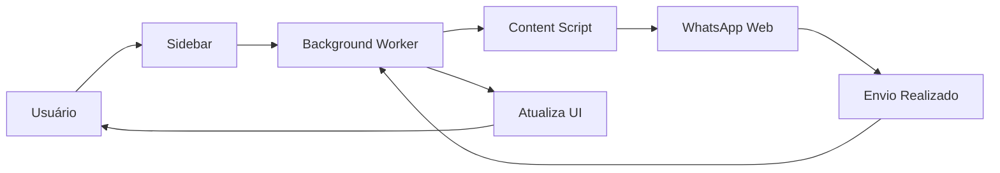

# 📱 WhatsApp Bulk Sender Pro

> Extensão Chrome profissional para envio em massa no WhatsApp Web com templates, agendamento e relatórios completos.


## ✨ Funcionalidades

### 🚀 Envio em Massa
- ✅ Envie mensagens para milhares de contatos
- ⏱️ Controle de intervalo entre mensagens (anti-ban)
- 🎲 Intervalo aleatório para máxima segurança
- ⏸️ Pausar e retomar envios a qualquer momento
- 📊 Acompanhamento em tempo real

### 📝 Sistema de Templates
- 💾 Salve mensagens frequentes como templates
- 🔄 Reutilize templates com um clique
- ✏️ Edite e exclua templates facilmente
- 📋 Organize suas mensagens

### 🎨 Variáveis Dinâmicas
Use variáveis para personalizar mensagens:
- `{nome}` - Nome do contato
- `{data}` - Data atual (dd/mm/aaaa)
- `{hora}` - Hora atual (hh:mm:ss)
- `{dia}` - Dia do mês
- `{mes}` - Mês atual
- `{ano}` - Ano atual

### 📊 Relatórios Completos
- 📈 Histórico de todos os envios
- ✅ Contagem de enviadas/falhas/pendentes
- ⏱️ Tempo total de cada campanha
- 💾 Últimos 50 relatórios salvos

### 🎯 Interface Moderna
- 🖥️ Sidebar lateral deslizante
- 📱 Design responsivo
- 🎨 Visual moderno e intuitivo
- ⚡ Performance otimizada

## 📦 Instalação

### Método 1: Modo Desenvolvedor (Recomendado)

1. **Baixe o projeto:**
   ```bash
   git clone https://github.com/your-repo/whatsapp-bulk-sender.git
   cd whatsapp-bulk-sender
   ```

2. **Abra o Chrome:**
   - Navegue até `chrome://extensions/`
   - Ative o "Modo do desenvolvedor" (canto superior direito)

3. **Carregue a extensão:**
   - Clique em "Carregar sem compactação"
   - Selecione a pasta `whatsapp-bulk-sender`

4. **Pronto! 🎉**
   - A extensão está instalada e pronta para uso

### Método 2: Chrome Web Store
*(Em breve)*

## 🎓 Como Usar

### 1️⃣ Acesse o WhatsApp Web
```
https://web.whatsapp.com
```

### 2️⃣ Clique no Botão Verde
Você verá um botão flutuante verde no canto inferior direito.

### 3️⃣ Adicione Contatos
**Opção A: Colar Lista**
```
11987654321
11912345678
21987654321
```

**Opção B: Importar Arquivo (.txt ou .csv)**
```csv
11987654321
11912345678
21987654321
```

### 4️⃣ Digite sua Mensagem
```
Olá {nome}! 👋

Estamos entrando em contato no dia {data}.

Atenciosamente,
Sua Empresa
```

### 5️⃣ Configure o Intervalo
```
⏱️ Intervalo: 8-12 segundos (recomendado)
🎲 Ativar intervalo aleatório: ✅
```

### 6️⃣ Inicie o Envio
```
📤 Clique em "Iniciar Envio"
⏸️ Pause quando necessário
📊 Acompanhe o progresso em tempo real
```

## ⚙️ Configurações Recomendadas

### Para Evitar Bloqueios

| Configuração | Valor Recomendado | Motivo |
|--------------|-------------------|---------|
| Intervalo Mínimo | 8 segundos | Parece envio manual |
| Intervalo Máximo | 12 segundos | Variação natural |
| Intervalo Aleatório | ✅ Ativado | Simula comportamento humano |
| Mensagens por Dia | < 500 | Limite seguro |
| Horário | 9h - 18h | Horário comercial |

### Boas Práticas

✅ **FAÇA:**
- Use intervalo de 8-12 segundos
- Ative intervalo aleatório
- Personalize mensagens com variáveis
- Envie apenas para contatos autorizados
- Respeite horário comercial
- Teste com poucos contatos primeiro

❌ **NÃO FAÇA:**
- Enviar spam
- Usar intervalo menor que 5 segundos
- Enviar para números desconhecidos
- Ignorar bloqueios do WhatsApp
- Enviar mensagens à madrugada

## 🗂️ Estrutura do Projeto

```
whatsapp-bulk-sender/
│
├── manifest.json              # Configuração da extensão
├── background.js              # Service Worker (gerencia envios)
│
├── content/                   # Scripts injetados no WhatsApp
│   ├── content.js            # Interage com WhatsApp Web
│   └── content.css           # Estilos do botão flutuante
│
├── sidebar/                   # Interface principal
│   ├── sidebar.html          # HTML da sidebar
│   ├── sidebar.css           # Estilos modernos
│   └── sidebar.js            # Lógica da sidebar
│
├── popup/                     # Popup do ícone da extensão
│   ├── popup.html            # HTML do popup
│   ├── popup.css             # Estilos do popup
│   └── popup.js              # Lógica do popup
│
└── icons/                     # Ícones da extensão
    ├── icon16.png
    ├── icon48.png
    └── icon128.png
```

## 🔧 Tecnologias

- **Chrome Extension Manifest V3**
- **JavaScript ES6+**
- **HTML5 & CSS3**
- **Chrome Storage API**
- **Chrome Messaging API**

## 📊 Fluxo de Funcionamento



## 🛡️ Segurança & Privacidade

- ✅ **100% Local** - Nenhum dado é enviado para servidores externos
- ✅ **Open Source** - Código totalmente auditável
- ✅ **Sem Analytics** - Não rastreamos seu uso
- ✅ **Sem Permissões Excessivas** - Apenas o necessário
- ✅ **Código Limpo** - Sem obfuscação ou código malicioso

## 🐛 Problemas Comuns

### ❓ Botão verde não aparece
**Solução:** Recarregue a página do WhatsApp Web (F5)

### ❓ Mensagens não estão sendo enviadas
**Solução:** 
1. Verifique se o WhatsApp Web está logado
2. Teste com um único contato primeiro
3. Verifique o console (F12) para erros

### ❓ "Erro ao abrir chat"
**Solução:**
- Número pode estar incorreto
- Número pode não existir no WhatsApp
- Tente com código de país (+55)

### ❓ WhatsApp bloqueou minha conta
**Prevenção:**
- Use intervalos maiores (10-15s)
- Envie menos mensagens por dia
- Não use em contas novas

## 🤝 Contribuindo

Contribuições são bem-vindas! 

1. Fork o projeto
2. Crie uma branch: `git checkout -b feature/NovaFuncionalidade`
3. Commit suas mudanças: `git commit -m 'Adiciona nova funcionalidade'`
4. Push para a branch: `git push origin feature/NovaFuncionalidade`
5. Abra um Pull Request

## 📝 Licença

Este projeto está sob a licença MIT. Veja o arquivo [LICENSE](LICENSE) para mais detalhes.

## ⚠️ Aviso Legal

**USO RESPONSÁVEL:**

Esta extensão foi desenvolvida para fins educacionais e para facilitar comunicações legítimas. O desenvolvedor não se responsabiliza por:

- Bloqueios ou banimentos no WhatsApp
- Uso indevido da ferramenta (spam, etc)
- Violação dos Termos de Serviço do WhatsApp
- Qualquer dano ou prejuízo causado pelo uso

**IMPORTANTE:**
- Use apenas para comunicações autorizadas
- Respeite as regras do WhatsApp
- Não envie spam
- Obtenha consentimento dos destinatários
- Use com responsabilidade

## 📞 Suporte

- 🐛 **Bugs:** [Abra uma issue](https://github.com/your-repo/whatsapp-bulk-sender/issues)
- 💬 **Dúvidas:** [Discussões](https://github.com/your-repo/whatsapp-bulk-sender/discussions)
- 📧 **Contato:** seu-email@exemplo.com

## 🌟 Apoie o Projeto

Se esta extensão foi útil para você, considere:

- ⭐ Dar uma estrela no GitHub
- 🐛 Reportar bugs
- 💡 Sugerir melhorias
- 🤝 Contribuir com código
- 📢 Compartilhar com amigos

---

<div align="center">

**Desenvolvido com ❤️ para a comunidade**

[GitHub](https://github.com/your-repo) • [Issues](https://github.com/your-repo/issues) • [Docs](https://github.com/your-repo/wiki)

</div>

